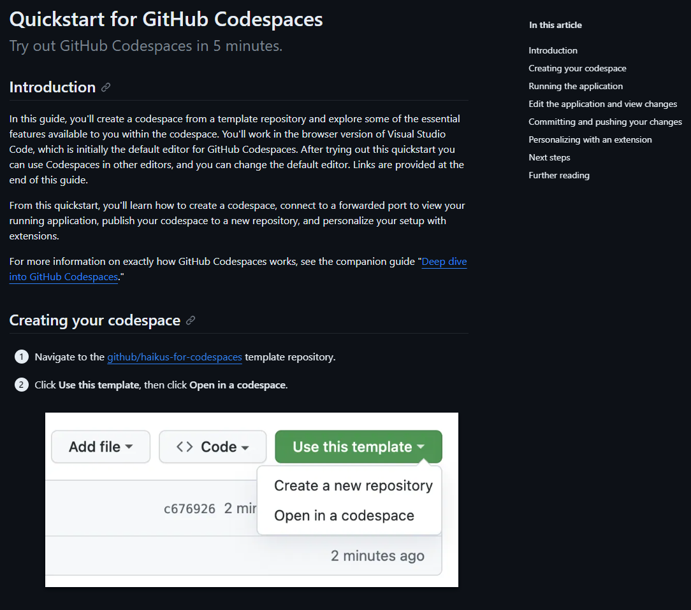
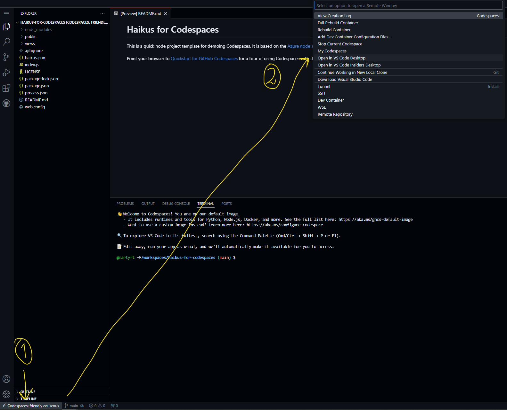

# Pre-workshop: Test oppsett av Codespaces

Et av stegene innenfor både applikasjonsmodernisering og containerisering er å endre tjenesten til å bruke Microsoft Authentication Library (MSAL). Dette skiftet er avgjørende for applikasjoner som migreres fra tradisjonelle IIS-baserte tjenester til en mer moderne, containerisert arkitektur i Azure.

## Hovedpunkter:

1. **Bruk av GitHub Codespaces**
   
   - Opplev fordelen med å bruke Codespaces som utviklingsverktøy. Vi viser deg hvordan du enkelt kan sette opp og kjøre din applikasjon med en integrert IDE og kjøremiljø, helt uten behov for manuell oppsett av infrastruktur.

## HOWTO:

1. Gå inn på [Quickstart for GitHub Codespaces](https://docs.github.com/en/codespaces/getting-started/quickstart)

2. Åpne i VS Code: Følg stegene i punkt 1. Trykk deretter på knappen nederst i venstre hjørne, og velg "Open in VS Code Desktop" (se bilde)

3. Forsett å følge quickstart-guiden fra punkt 1

## For å utforske mer:

- [Next steps](https://docs.github.com/en/codespaces/getting-started/quickstart#next-steps)

- [Further reading](https://docs.github.com/en/codespaces/getting-started/quickstart#further-reading)
