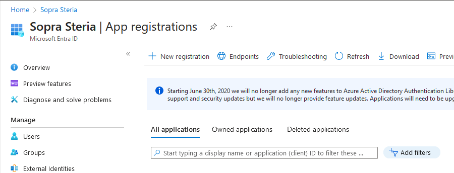
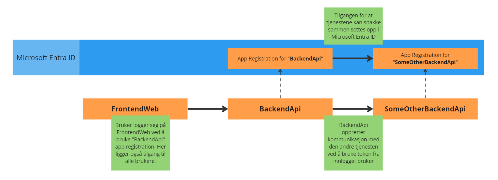

# Workshop: Implementering av MSAL i containeriserte .NET Applikasjoner

Et av stegene innenfor både applikasjonsmodernisering og containerisering er å endre tjenesten til å bruke Microsoft Authentication Library (MSAL). Dette skiftet er avgjørende for applikasjoner som migreres fra tradisjonelle IIS-baserte tjenester til en mer moderne, containerisert arkitektur i Azure.

## Hovedpunkter:

1. **Oppsett av MSAL:**
   
   - Vi skal gå gjennom hvordan du setter opp MSAL (Microsoft Authentication Library) autentisering for en applikasjon som kjører i en container i Azure.

2. **Bruk av GitHub Codespaces**
   
   - Opplev fordelen med å bruke Codespaces som utviklingsverktøy. Vi viser deg hvordan du enkelt kan sette opp og kjøre din applikasjon med en integrert IDE og kjøremiljø, helt uten behov for manuell oppsett av infrastruktur.

# Oppsett av MSAL

## Hva er MSAL?

TL;DR: MSAL (Microsoft Authentication Library) er et bibliotek utviklet av Microsoft for å hjelpe applikasjoner med å autentisere brukere og få tilgang til Microsofts skytjenester og API-er som Microsoft 365, Azure, og mer, ved bruk av standardiserte protokoller som OAuth 2.0 og OpenID Connect. Det forenkler sikkerhetstokenhåndtering og støtter flere programmeringsspråk og plattformer.

MSAL brukes til å autentisere brukere i webklienten, slik at den kan kommunisere med backendtjenesten. Backendtjenesten sjekker deretter at brukeren er autentisert og har riktige roller og tilganger. Videre kan backendtjenesten kalle på andre tjenester med den innloggede brukeren. 

## Opprett en App registration i Microsoft Entra ID (tidligere Azure AD)

1. Gå til https://portal.azure.com/ og logg inn med Sopra Steria brukerenn

2. Gå til [https://portal.azure.com/#view/Microsoft_AAD_IAM/ActiveDirectoryMenuBlade/~/RegisteredApps](https://portal.azure.com/#view/Microsoft_AAD_IAM/ActiveDirectoryMenuBlade/~/RegisteredApps)
   
   

3. Klikk på "New registration"

4. Finn kun på en fanzy app "Name", og klikk på "Register"

**Tada! Du har laget en (din første?) App Registration**

