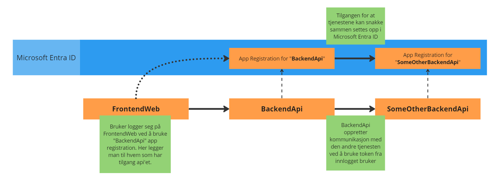
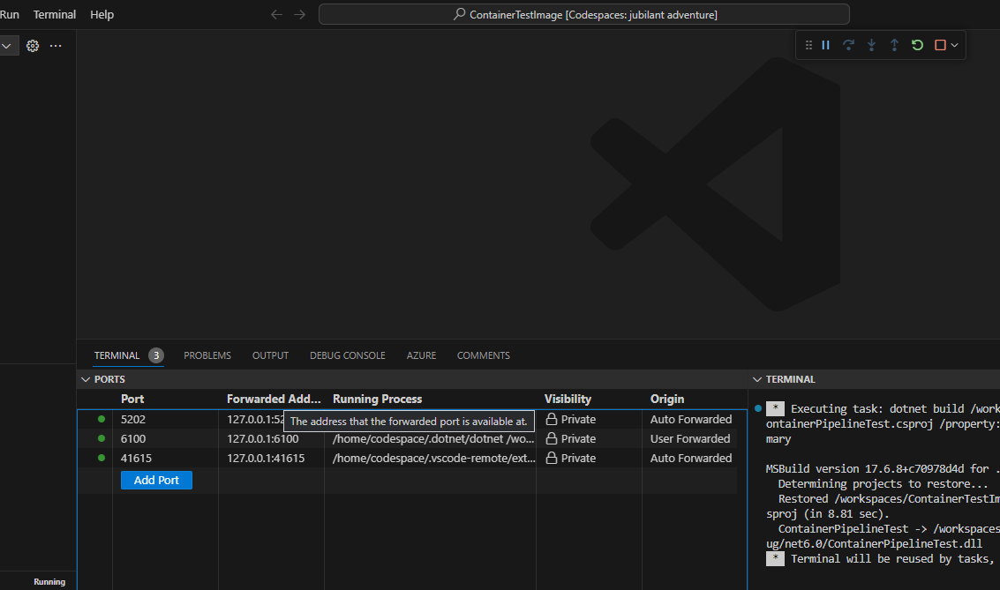
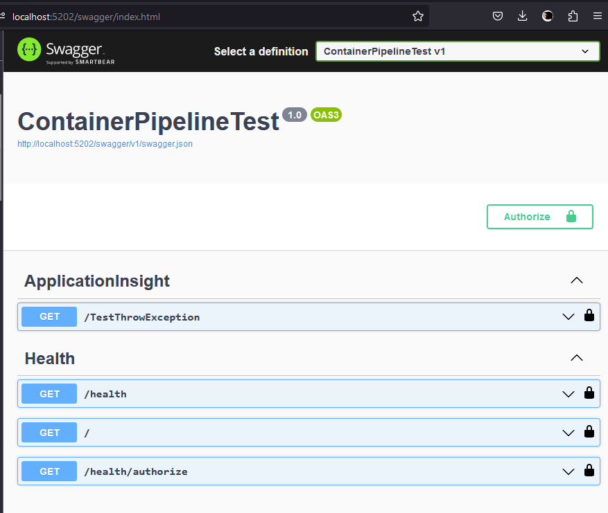
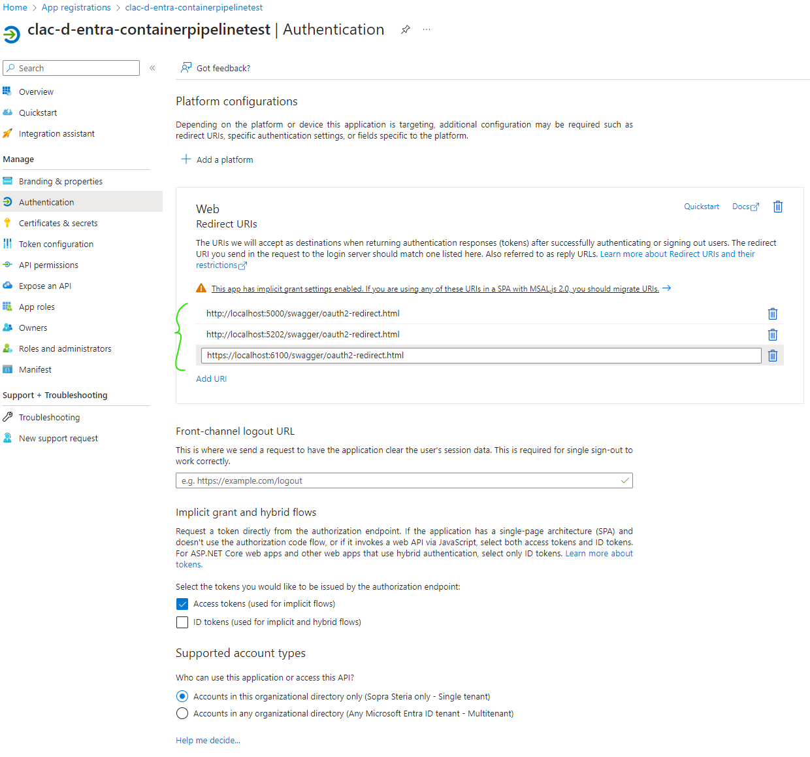
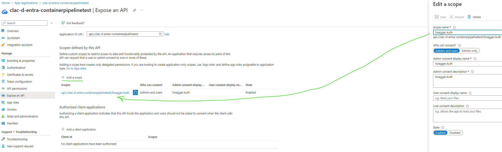

# Workshop: Implementering av MSAL i containeriserte .NET Applikasjoner

Et av stegene innenfor både applikasjonsmodernisering og containerisering er å endre tjenesten til å bruke Microsoft Authentication Library (MSAL). Dette skiftet er avgjørende for applikasjoner som migreres fra tradisjonelle IIS-baserte tjenester til en mer moderne, containerisert arkitektur i Azure.

## Hovedpunkter:

1. **Oppsett av MSAL:**
   
   - Vi skal gå gjennom hvordan du setter opp MSAL (Microsoft Authentication Library) autentisering for en applikasjon som kjører i en container i Azure.

2. **Bruk av GitHub Codespaces**
   
   - Opplev fordelen med å bruke Codespaces som utviklingsverktøy. Vi viser deg hvordan du enkelt kan sette opp og kjøre din applikasjon med en integrert IDE og kjøremiljø, helt uten behov for manuell oppsett av infrastruktur.

# Oppsett av MSAL

## Hva er [MSAL](https://learn.microsoft.com/en-us/entra/identity-platform/msal-overview)?

TL;DR: MSAL (Microsoft Authentication Library) er et bibliotek utviklet av Microsoft for å hjelpe applikasjoner med å autentisere brukere og få tilgang til Microsofts skytjenester og API-er som Microsoft 365, Azure, og mer, ved bruk av standardiserte protokoller som OAuth 2.0 og OpenID Connect. Det forenkler sikkerhetstokenhåndtering og støtter flere programmeringsspråk og plattformer.

MSAL brukes til å autentisere brukere i webklienten, slik at den kan kommunisere med backendtjenesten. Backendtjenesten sjekker deretter at brukeren er autentisert og har riktige roller og tilganger. Videre kan backendtjenesten kalle på andre tjenester med den innloggede brukeren. 

## Opprett en App registration i Microsoft Entra ID (tidligere Azure AD)

1. Gå til https://portal.azure.com/ og logg inn med Sopra Steria brukeren din

2. Gå til [https://portal.azure.com/#view/Microsoft_AAD_IAM/ActiveDirectoryMenuBlade/~/RegisteredApps](https://portal.azure.com/#view/Microsoft_AAD_IAM/ActiveDirectoryMenuBlade/~/RegisteredApps)
   
   

3. Klikk på "New registration"

4. Finn på et fanzy app "Name", og klikk på "Register"

**Tada! Du har laget en (din første?) App Registration**



## Registrer din App Registration i ContainerTestImage

1. Finn filen "**appsettings.json**"

```
{
   "AzureAd": {
      "Instance": "https://login.microsoftonline.com/",
      "ClientId": "api://clac-d-entra-containerpipelinetest",
      "Audience": "api://clac-d-entra-containerpipelinetest",
      "TenantId": "8b87af7d-8647-4dc7-8df4-5f69a2011bb5",
      "ClientSecret": ""
   }
}
```

2. Bytt verdiene til **ClientId** og **Audience** med navnet på din App Registration

3. Start tjenesten ved å trykke på F5

4. Gå til URL: [http://localhost:5202/swagger/index.html](http://localhost:5202/swagger/index.html)

Dette starter tjenesten i kjøremiljøet til Codespaces og lager en [Remote Tunnel](https://code.visualstudio.com/docs/remote/tunnels) som fungerer som en port forwarding mot din laptop sin localhost, slik at tjenesten blir tilgjengelig tilsynelatende på din lokale laptop på [http://localhost:5202/swagger/index.html](http://localhost:5202/swagger/index.html)

Da dukker dette opp i VSCode som viser hvilke porter som forwardet til din laptop:




## Logg inn med MSAL i Swagger

Nå ser du omtrent dette:





1. Klikk på "**Authorize**" og logg inn med Sopra Steria brukeren


Access denied !
Vi må legge til riktig redirect i App Registration.


# Legg til Redirect URIs
2. Legg til Redirect URIs slik at applikasjonen vår kan autentisere ved bruk av OAuth provideren (Microsoft Entra ID), motta access token, verifisere dine credentials og redirecte tilbake til applikasjonen.

For utvidet forståelse, gå til: [Microsoft Entra ID authentication flow](https://learn.microsoft.com/en-us/entra/architecture/auth-oauth2)

Får du fortsatt ikke autentisert??

# Spesifiser scopes for applikasjonen
3. Legg til scope for API'et under "Expose an API" i Application Registration. Når en applikasjon spør om tilgang til en annen applikasjon, så må den spesifisere hvilke scopes den skal ha tilgang til. 

